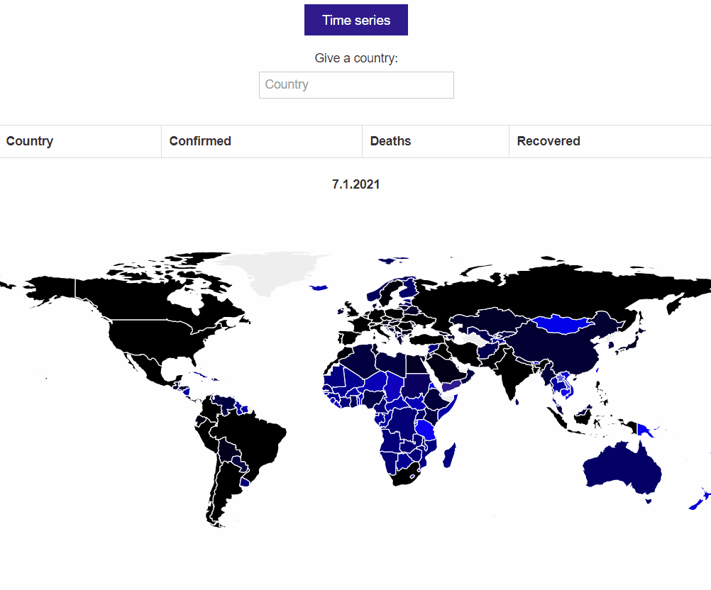

## About

Different Covid-19 data displayed in a D3 world map.
- Current situation (default)
  - Country's color corresponds to its Covid state (hsl algorithm provided by course staff)
- Current situation by country
  - its and the neighbouring countries' Covid states will be displayed on the map
  - country's data will be displayed on a table
- Time-series animation of the world's Covid situation per country 

This used to be part of older coursework and I wanted to get running as it used depricated API.

Data is now fetched from:
[Current situation](https://covid2019-api.herokuapp.com/docs) &
[Time series](https://github.com/pomber/covid19)

## Viewing the project

Save the files and open index.html in a browser.

## Fixed bugs

- Animation:

:heavy_check_mark: Can be stopped

:heavy_check_mark: Can be played multiple times

:heavy_check_mark: Ends in the current date after which country stats search is fully available

- Country stats search

:heavy_check_mark: Does not intervene with a playing animation
